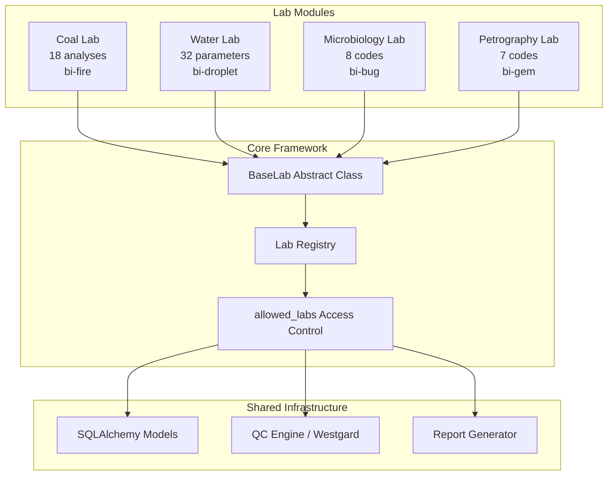
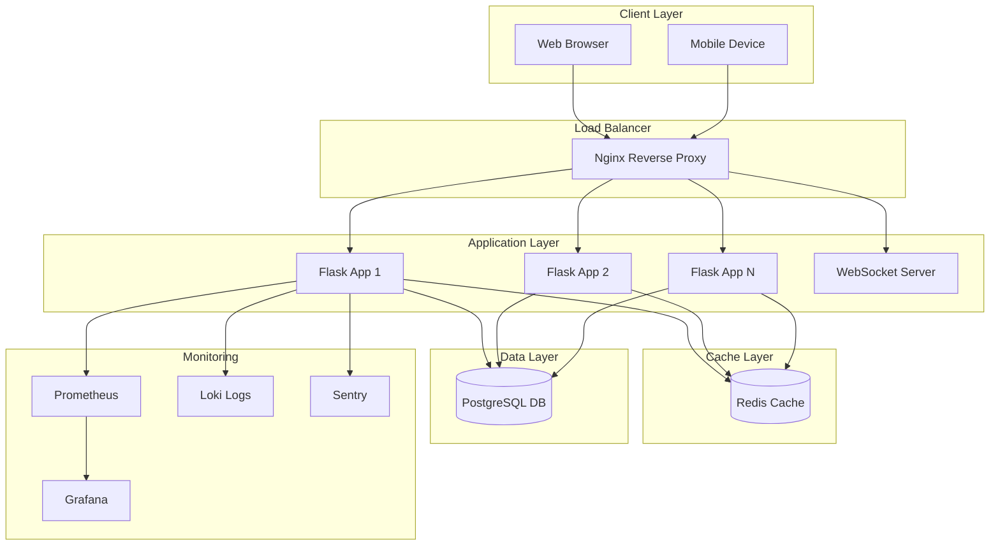
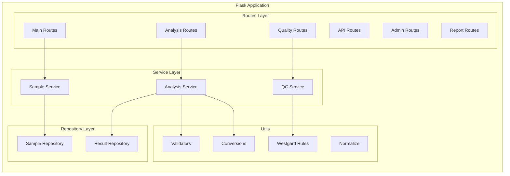
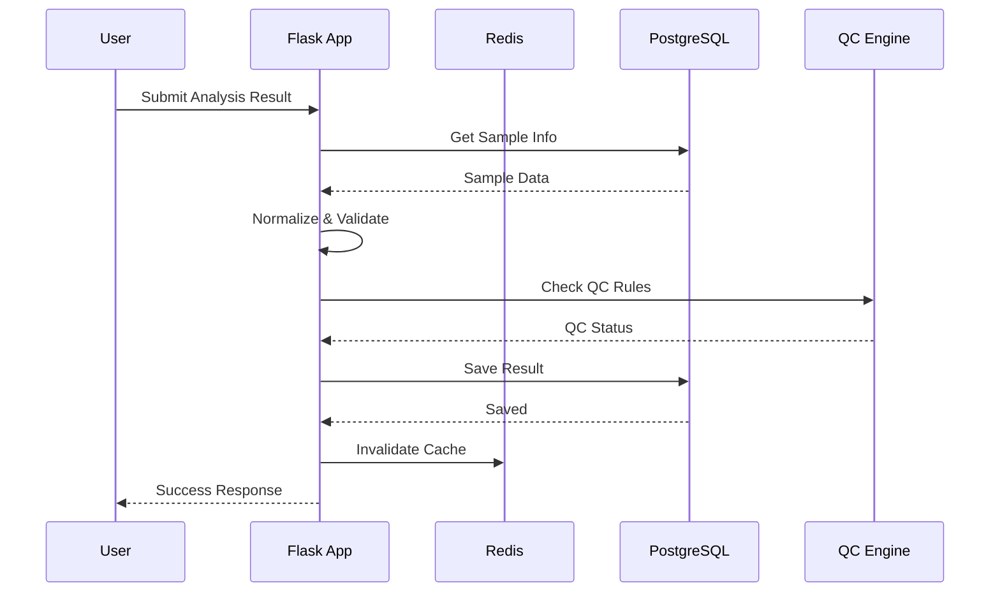
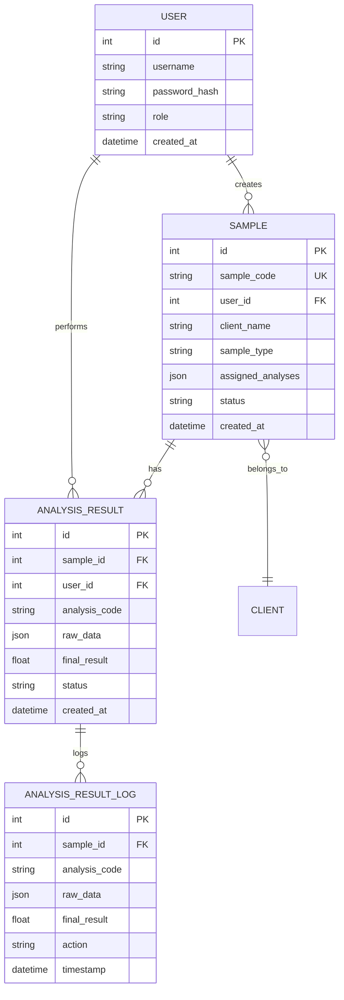
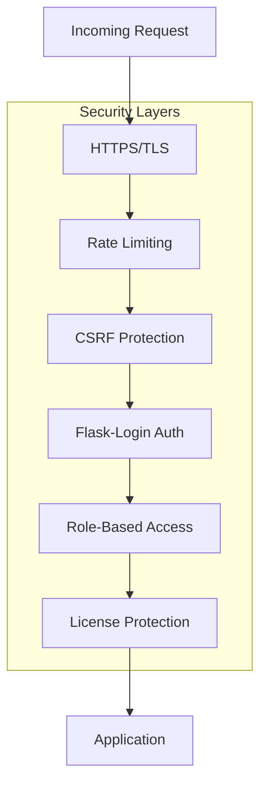
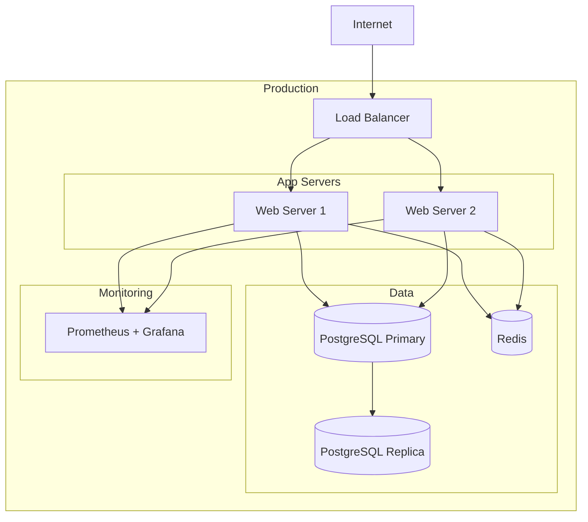
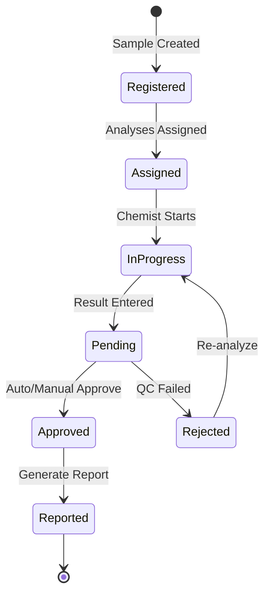
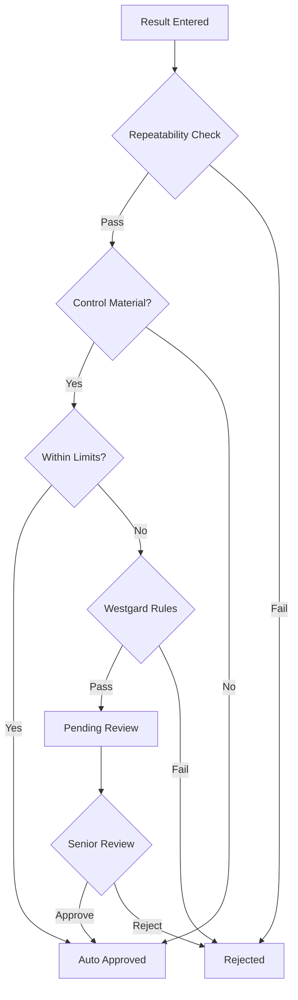

# LIMS - System Architecture

## Overview

LIMS нь лабораторийн мэдээллийн удирдлагын систем бөгөөд 4 лабораторийн модулийг (Coal, Water, Microbiology, Petrography) дэмжих ISO 17025 стандартын дагуу хөгжүүлэгдсэн.

## Multi-Lab Architecture



### BaseLab Pattern

Бүх лабораторийн модулиуд `BaseLab` абстракт класс-аас удамшина. Энэ нь дараах гол атрибут, методуудыг тодорхойлно:

- **key** — лабын дотоод нэр (жнь: `"coal"`, `"water"`)
- **name** — хэрэглэгчид харагдах нэр
- **icon** — Bootstrap icon class
- **color** — UI өнгө
- **analysis_codes** — тухайн лабын шинжилгээний кодуудын жагсаалт
- **get_blueprint()** — Flask Blueprint буцаана
- **sample_query()** — тухайн лабын дээжийн query буцаана
- **sample_stats()** — тухайн лабын статистик мэдээлэл буцаана

### allowed_labs Access Control

Хэрэглэгч бүрийн `allowed_labs` талбар нь тухайн хэрэглэгчийн хандах боломжтой лабуудыг тодорхойлно. Админ хэрэглэгч бүрт лабын эрхийг тусад нь тохируулж өгнө. Зөвшөөрөгдөөгүй лабын route, API-д хандахыг хориглоно.

## High-Level Architecture



## Component Architecture



## Data Flow



## Database Schema (Core Tables)



## Module Structure

```
app/
├── __init__.py              # Application factory
├── models.py                # SQLAlchemy models
├── constants.py             # Analysis aliases, constants
├── monitoring.py            # Prometheus metrics
├── sentry_integration.py    # Error tracking
│
├── labs/                    # Multi-lab modules
│   ├── __init__.py          # Lab registry, LAB_TYPES
│   ├── base.py              # BaseLab abstract class
│   ├── coal/                # Coal lab (18 analyses)
│   ├── water/               # Water lab (32 parameters)
│   ├── microbiology/        # Microbiology lab (8 codes)
│   └── petrography/         # Petrography lab (7 codes)
│
├── routes/                  # Core + Coal routes
│   ├── main/               # Main pages (index, login)
│   ├── analysis/           # Analysis workspace
│   ├── api/                # REST API endpoints
│   ├── admin_routes.py     # Admin panel
│   ├── report_routes.py    # Report generation
│   ├── quality/            # QC management
│   └── equipment_routes.py # Equipment tracking
│
├── services/               # Business logic
│   ├── sample_service.py
│   └── analysis_audit.py
│
├── repositories/           # Data access
│   ├── sample_repository.py
│   └── analysis_result_repository.py
│
├── utils/                  # Utilities
│   ├── validators.py       # Input validation
│   ├── conversions.py      # Unit conversions
│   ├── normalize.py        # Data normalization
│   ├── westgard.py         # Westgard QC rules
│   ├── qc.py              # QC checks
│   └── server_calculations.py  # Analysis formulas
│
├── templates/              # Jinja2 templates
│   ├── base.html
│   ├── index.html
│   └── ...
│
└── static/                 # Static assets
    ├── css/
    ├── js/
    └── images/
```

## Technology Stack

| Layer | Technology |
|-------|------------|
| Frontend | HTML5, CSS3, JavaScript, Alpine.js, htmx, AG Grid |
| Backend | Python 3.11, Flask 3.x |
| Database | PostgreSQL 15 |
| Cache | Redis 7 |
| Web Server | Gunicorn + Nginx |
| Containerization | Docker, Docker Compose |
| Monitoring | Prometheus, Grafana, Loki, Sentry |
| Testing | pytest, Playwright, k6 |

## Security Architecture



## Deployment Architecture



## Analysis Workflow



## QC Decision Flow


